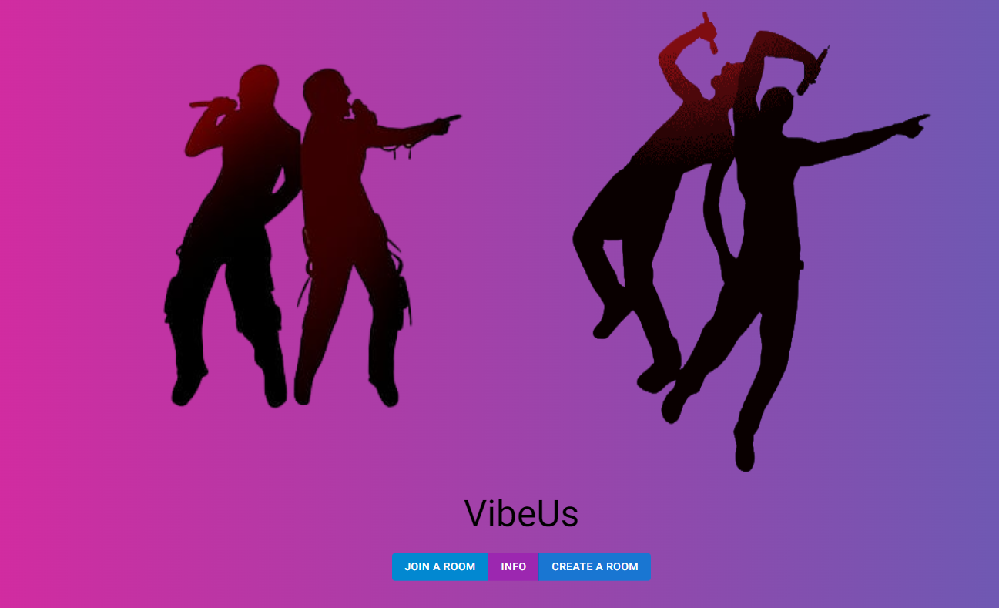
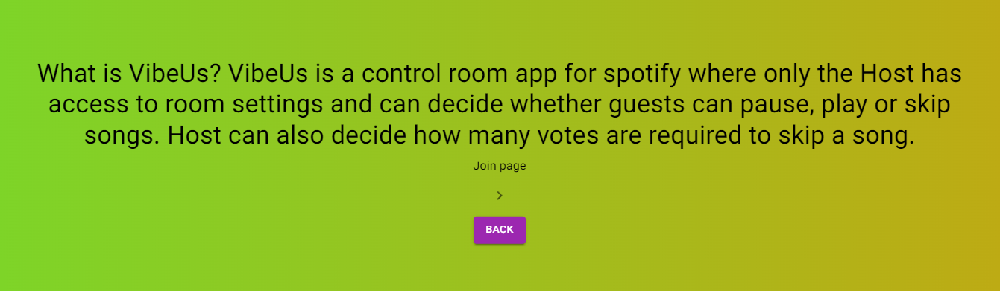
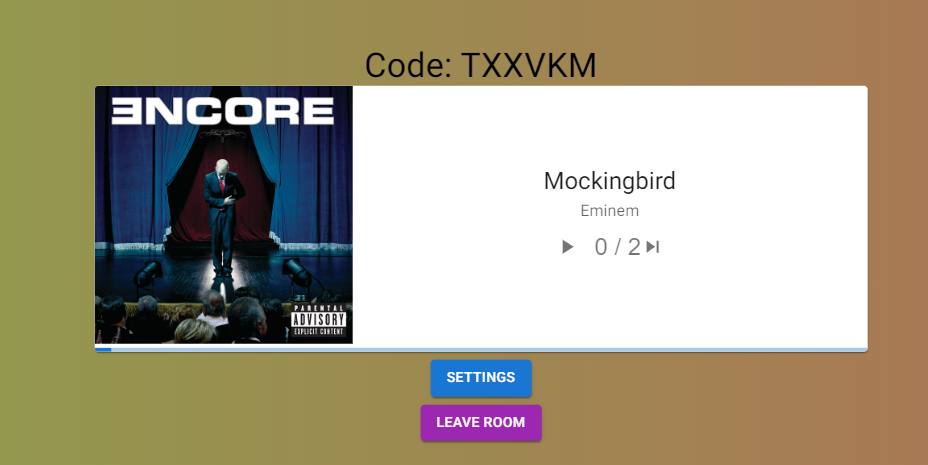

# VibeUs

A Music control room system using Django and React, This is the final project for CS50's Web Programming with Python and JavaScript.

[Video Demonstration](https://youtu.be/tkp4ew1LFew)

## Distinctiveness and Complexity:

### Project Structure:

This project consists of 3 main parts: frontend, backend and Spotify API:
- Frontend: Used functional components for this project as they are more compatible with the latest React versions, each feature was presented using a separate component.
- Backend: Used Python models, class serializers and React Router to control everything on the backend including Data and Routing.
- Spotify API:
  - Used the Spotify API to authenticate users using their spotify account and giving them an authentication token.
  - The authentication token is automatically used again after the expiration period to avoid requesting more tokens unnecessarily.
  - Data is being fetched continuously from the Room creator's Spotify player and sent to the main room.

### Motivation

The idea was to create a controlled environment for a group of friends to listen to music together (like a discord bot) but with more controls and more functionality where the user has complete access for the room settings including the ability to allow guests to have control over the room while respecting everyone's taste by using a voting system where the room owner decides how many votes are required to skip songs.

### Justification

This project is distinct from all previous projects as:

- It has models with complex relations between them.
- Uses React and React Router.
- Complex Authentication and Authorization system.
- Uses RESTful API.
- Uses the spotify API.
- Authenticates the user using their own spotify account.
- Uses a CSS Framework (Material-UI)
- A voting system that updates in Real time for all the users to skip songs.
- A room control system that is visible to everyone but only controllable by the guests if the room owner allows it.
- Flexible settings that can be set while creating the room and can be changed after the room is created.
- Saves the user's authentication history.

### Requirements:

This project utilizes:

- Python on the backend using Django framework:
  - 3 models were used: Room, SpotifyToken and Vote.
- HTML, CSS and Javascript on the frontend using React framework.
- This app is mobile responsive.
- File content: Files [Go to Files](#files).
- How to run this application: Setup [Go to Setup](#setup).
- All packages that need to be installed (Dependencies): requirements.txt
  [Go to Dependencies](#dependencies).

## Table of content:

- [Project Description](#project-description)
- [Stack and Frameworks](#stack-and-frameworks)
- [Features](#features)
- [Dependencies](#dependencies)
- [Setup](#setup)
- [Instructions](#instructions)

## Project Description:

### Course:

CS50's Web Programming with Python and JavaScript (CS50W)

### Theme:

This project allows users to either create a room or join other user's room where they all can listen to music together and control what's happening according to their liking using customized settings.

### Overview:

VibeUs is a control room app for spotify where only the Host has access to room settings and can decide whether guests can pause, play or skip songs.
Host can also decide how many votes are required to skip a song.

## Stack and Frameworks:

This project was developed using:

- Frontend: HTML, CSS and Javascript
- Backend: Python
- Frameworks: React, Django, REST, Material UI

## Features:

- Authentication
- Authorization
- Create Room
- Set Room settings
- Set number of votes required to skip songs
- Set Guest Controls
- Update settings inside the Room
- Allow/Disable guest controls
- Realtime system management
- Realtime voting system to skip songs
- Save user authentication info, if you join a room and don't Leave it, you're redirected to the room whenever you go to the homepage.

## Code Style:

- Prettier
- Camel Case

## Dependencies:

- "@babel/core": "^7.23.2",
- "@babel/preset-env": "^7.23.2",
- "@babel/preset-react": "^7.22.15",
- "babel-loader": "^9.1.3",
- "react": "^18.2.0",
- "react-dom": "^18.2.0",
- "webpack": "^5.89.0",
- "webpack-cli": "^5.1.4"
- "@babel/plugin-proposal-class-properties": "^7.18.6",
- "@emotion/react": "^11.11.1",
- "@emotion/styled": "^11.11.0",
- "@mui/icons-material": "^5.14.14",
- "@mui/material": "^5.14.14"

## Setup:

- git clone git@github.com:YoussefSoliman96/vibeus.git

- Browse to https://developer.spotify.com/dashboard/applications.
- Log in with your Spotify account.
- Click on ‘Create an app’.
- Pick an ‘App name’ and ‘App description’ of your choice and mark the checkboxes.
- After creation, you see your ‘Client Id’ and you can click on ‘Show client secret` to unhide your ’Client secret’.
- Use your ‘Client id’ and ‘Client secret’ to retrieve a token from the Spotify API. The function get_spotify_api_token() performs all necessary steps with your ‘Client id’ and ‘Client secret’ to retrieve a token. Consider to assign this character string to a variable named ‘my_token’, which is the default value for all spotidy functions that are in need of a token.

- First terminal
  > python manage.py runserver
- Second terminal:
  > cd frontend
  > npm run dev
- Install project dependencies by running pip install -r requirements.txt
- Make and apply migrations by running python manage.py makemigrations and python manage.py migrate.

## Files:

`Note: All configuration related files are explained in the instructions section`
[Instructions](#instructions)

- `music` - Main project directory.
  - `urls.py` - contains all main urls (homepage - api - spotify API - Admin panel).
  - `settings.py` - contains all the App settings like installed apps and allowed Hosts.

### 3 Apps were made: api, frontend and spotify

- `api` - Backend directory.
  - `models.py` - the Room model including all the info in the room and settings pages.
  - `serializers.py` - serializer classes related to the REST Framework to convert models and querysets to native python code to be used in the views file.
  - `apps.py` - the api app configuration file.
  - `tests.py` - for unit tests to be added later.
  - `urls.py` - urls to the backend info, they show all the data in the backend during runtime.
  - `views.py` - all backend views and the logic behind user interactions.
- `frontend` - Frontend directory.
  - `src` - frontend source files.
    - `src/components` - frontend components.
      - `App.js` - main frontend component, this is what gets displayed when the user first visits the webpage, it contains the Homepage component.
      - `CreateRoomPage.js` - component used to display the (Create Room) page when the user clicks the (Create Room) button and modified to (Update Room) when the user clicks the (Update Room) button inside the room.
      - `HomePage.js` - main page layout, it contains everything you see when you first visit the website, like Create Room, Join room and Info Page.
      - `info.js` - information component, it displays a brief explanation of the app functionality to the user with an arrow button rotating between the app pages' names.
      - `JoinRoomPage.js` - component used to display the (Join Room) page which contains a form where the user enters the room code or get back to the Homepage using the (Back) button.
      - `MusicPlayer.js` - the music player component which contains a play/pause, skip buttons and the info we get from the spotify API about the song like the picture, singer, song name and progress bar.
      - `Room.js` - the room component which the user is redirected to after creating or joining a room, it contains the Room Code, Music Player, Settings and Leave Room buttons.
      - `withRouter.js` - react router hooks.
    - `src/index.js` - layout background animations.
  - `static` - static content (CSS and images)
    - `static/css/index.css` - common styles for all pages.
    - `static/frontend/main.js` - code for routing or calling components which gets rendered.
    - `static/images` - all images that are being imported/used in the app.
  - `templates/index.html` - main application HTML layout where all React components are rendered.
  - `apps.py` - the frontend app configuarion file.
  - `urls.py` - urls to the main app pages like join, create, info and main rooms.
  - `views.py` - the index view for the frontend app.
  - `babel.config.json` contains javascript compiler code that converts the code to a compatible version of JavaScript in current and older browsers.
- `spotify` - contains all spotify API related files
  - `apps.py` - the spotify app configuration file
  - `models.py` - models containing all information we need from the spotify API for our application like Spotify Token and Vote.
  - `credentials.py` - personal credentials used by the spotify API for authentication, this file was not pushed for production as it contains private keys, but I explained how to get them in the Setup section [Go to Setup](#setup).
  - `util.py` - utility functions to help excute the API calls/functionalities like playing, pausing or skipping a song.
  - `views.py` - views that control the the data we get from the API, it contains important classes that define authentication, shows all data related to the songs retrieved by the app through API calls, the functionality of pausing, playing or skipping songs based on the amount of votes required to skip a song.
  - `gitignore` - Ignored files for pushing to production to git.
  - `get-pip.py` - This is a base85 encoding of a zip file that contains an entire copy of pip.
  - `manage.py` - Django's command-line utility for administrative tasks.
  - All `package.json` files contain the Project dependencies.

## Screenshots

#### Create Room

#### Update Room

#### Homepage

#### Info Page

#### Join Room

#### Music Player

#### Main Room

## Instructions:

- install python3
- install pip3
- pip3 install django
- pip3 install django djangorestframework
- django-admin startproject api
- django-admin startapp api
- Go to installed apps folder > settings > installed apps >
  'api.apps.ApiConfig',
  'rest_framework',
- add to project urls file:
  path('api/', include('api.urls')),
- make app urls file and add [homepage] to it:
  path('', views.RoomView.as_view()),
- python3 manage.py makemigrations
- python3 manage.py migrate
- python3 manage.py runserver
- make serializer.py file inside api
- setup serializer
- edit app urls file and add [.as_view()] to the homepage path:
  path('', views.RoomView.as_view()),

- django-admin startproject frontend
- make these folders inside frontend:
  - src
    - src/components
  - static
    -static/css
    -static/frontend
    -static/images
  - templates

**Inside the frontend folder [React Integration Using Webpack & Babel]**

- install npm
- install these packages using npm:

  - npm init -y
  - npm i webpack webpack-cli --save-dev
  - npm i @babel/core babel-loader @babel/preset-env @babel/preset-react --save-dev
  - npm i react react-dom --save-dev
  - material ui V5
    - npm install @mui/material @emotion/react @emotion/styled
    - npm install @mui/icons-material
  - npm install @babel/plugin-proposal-class-properties
  - npm install react-router-dom

- make the configuration scripts, make these files inside frontend folder:

  - babel.config.json --> script: https://github.com/YoussefSoliman96/vibeus/blob/main/frontend/babel.config.json

  - webpack.config.js --> script: https://github.com/YoussefSoliman96/vibeus/blob/main/frontend/webpack.config.js

  - add these 2 scripts to package.json --> script: https://github.com/YoussefSoliman96/vibeus/blob/main/frontend/package.json
    - "dev": "webpack --mode development --watch",
    - "build": "webpack --mode production"

- make index.js file inside src folder
  - src/index.js
- make index.html inside frontend/templates folder and add HTML boilerplate into it
  - templates/index.html
- add "load static" and add script tags to index.html
- render index.html inside views.py in frontend folder
- make urls.py file inside frontend folder
- add to project urls file:
  path('', include('frontend.urls')),
- Go to installed apps folder > settings > installed apps >
  'frontend.apps.FrontendConfig',

**Make the first React component**

- make App.js file inside frontend/src/components
- make export default class extends Component
- src/index.js import App from "./components/App";
- npm run dev
